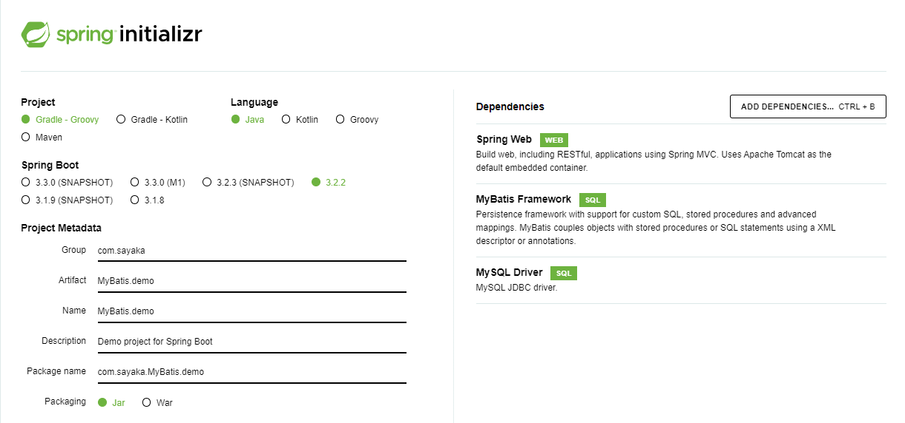
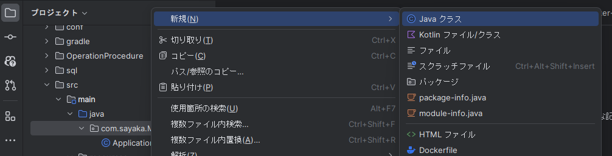

# 操作手順
  
## spring initializr
  
ZIPファイルを開いて自分がわかる場所に置く。  
  
## intellijでプロジェクトを立ち上げる
・プロジェクトを開くとき、階層が増えると間違えやすいからSpring initializrで作ったものを開く。  
   
  
・build.gradleにspring initializrで依存関係で追加したものがあるから確認。  
  
  
＜依存関係の追加方法＞  
   
  
※build.gradleに記載してあるバージョンも見ておく。  
  
  
## DBの構築
ディレクトリ構成。  
  
・ハンズオンをgit clone してプロジェクトを開く。
　開いたら、『conf』『sql』『docker-compose.yml』『Dokerfaile』をコピーしてさっき立ち上げたプロジェクトに貼り付ける。
  
### conf
・confは設定を意味する。  
・my.confはSQLに必要な設定を書いている。これがないと日本語でうまく情報を入れられない。  
  
  
・confはDockerfaileでコピーして使われている。  
  
　　
### sql
・コンテナ作成時にテーブルを作って入れようとしている。初期データみたいなイメージ。  
  
  
・このSQLファイルをdocker-compose.ymlの17行目で読み取っている。  
・entrypointが入るポイント、initdb.dがDBの初期化という意味。  
 　create-tableの中身をdocker-compose.ymlに突っ込んでいる。そうすることでコンテナが立ち上がる時にテーブルが作られて情報が登録される。  
  
  
### docker-compose.yml
アプリケーションを動かすための処理を記述しているファイル。  
  
・ports: -3307:3306  
　3306はMySQLを開くときの番号。3307にしているのがMySQLを自分のPC上にインストールしちゃうとDockerを立ち上げたときに3306同士だとケンカしちゃうから3307になっている。　　
　　
　　
＜ymlファイルの内容について詳しく書いてあるもの＞
https://qiita.com/gon0821/items/77369def082745d19c38　　
　　
### Dokerfaile
MySQLのコンテナをどうbuildしていくかが書いてある。  
  
  
※renovate.jsoは特に必要ない  
  
  
## プロジェクト
### sqlで自分の作りたいものを記述
  
  
### docker-compose.yml を書き換える
MYSQL_DATABASE は自分が扱いたいものに合わせたデータベース名にする。  
  
  
### コンテナを起動
起動コマンド：`docker compose up -d`
  
★　起動するときの注意点　★  
・自分が今いる場所を`pwd`で確認する。  
　さらにdocker-compose.ymlがあるところで起動させたいから`ls`をして確認。  
  
  
`docker ps`でコンテナが立ち上がってるか確認。  
`docker compose exec db mysql -uroot -p`でログインできるかも確認。  
  
  
DBの中身も確認しておく！！！  
  
### Spring BootからMySQLに接続する設定
src/main/resources ディレクトリ配下にある application.properties へ次のような記述が必要。  
```
spring.datasource.url=jdbc:mysql://localhost:{port番号}/{database名}
spring.datasource.username={ユーザー}
spring.datasource.password={パスワード 名}
```  
←application.properties  
←docker-compose.yml  
  
### MyBatisを使ったファイルを作成
MyBatisではファイル名を `扱いたいリソース名`+`Mapper` とするのが一般的。  
そして、DBに対してどのような操作をするかをメソッドで表現する。  
　　
ちなみにMyBatisではMappperと名付けるが、DBとやり取りするためのモジュールは `Repositoey` という呼び方をすることが多い。  
  
MyBatisを使ったファイルを作成する階層は `mainメソッドがあるApplicationクラス` と同じ階層で  
クラスではなくinterfaceで作成する。javaの階層で作っちゃうとうまく動かない。
  
  
  
・＠Mapperをつけ、ibatisをインポート。  
・@Select(SELECT文を記述)し、メソッドを記述。メソッドの記述が簡易的に書かれているのはinterfaceだから。  
　メソッド名は何でもいい。一目でどのようなメソッドなのかわかる名前にする。  
・NameMapperのメソッドの返り値として定義しているNameはデータベースのレコードに対応している。  
　アプリケーション全体の設計によるが、ここではエンティティとよぶ。  
　エンティティは文脈により違うものを表すことがあるが、ここではデータベースのレコードに対応 するものとして定義。  

  
  
・Nameクラスを定義。  
  
  
## READ処理
NameMapperを利用してテーブルからデータを読み取る処理を実装。  
Controllerのクラスを作り、記述。  

@RestControllerをつけないとSpringがコントローラーとして認識しないので必ずつける。  
```java

@RestController
public class NameController {
private final NameMapper nameMapper; //フィールド　ここでフィールドを定義しているからnameMapper.findAll()でNameMapperクラスのfindAllが使える。
public NameController(NameMapper nameMapper) {　//コンストラクタ
this.nameMapper = nameMapper;
}
@GetMapping("/names")
public List<Name> findAll() {
return nameMapper.findAll();
}
}
```
  
## クエリ文字
＜NameMapper＞
```java
@Select("SELECT * FROM names WHERE name LIKE CONCAT(#{prefix}, '%')")
    List<Name> findByNameStartingWith(String prefix); //prefix=接頭辞
```
・メソッド名のfindByNameStartingWithは自分で考えたもの  
・どんな文字で検索するかが必要なので引数が必要になる - (String prefix)  
・Select文のWHEREは検索条件を加えるときに使う。具体的な内容をその後ろに書く。  
　LIKEは「～のような」、nameがnameカラム、CONCAT(#{prefix}, '%')が検索設定のようなもの。  
  
＜NameController＞  
```java
 @GetMapping("/names")
 public List<Name> findByNames(@RequestParam String startsWith) {
 return nameMapper.findByNameStartingWith(startsWith);
```
