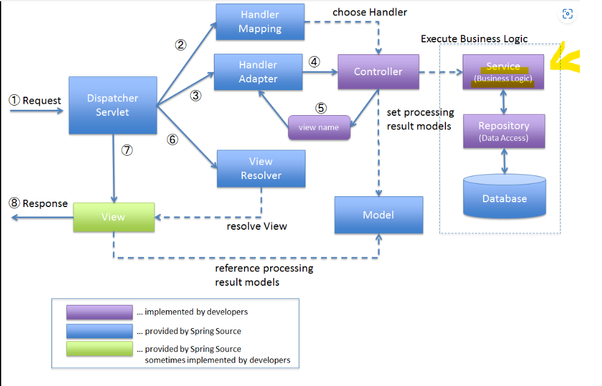
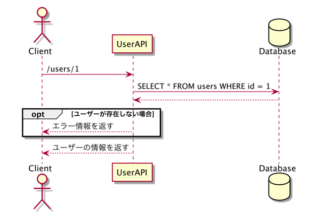
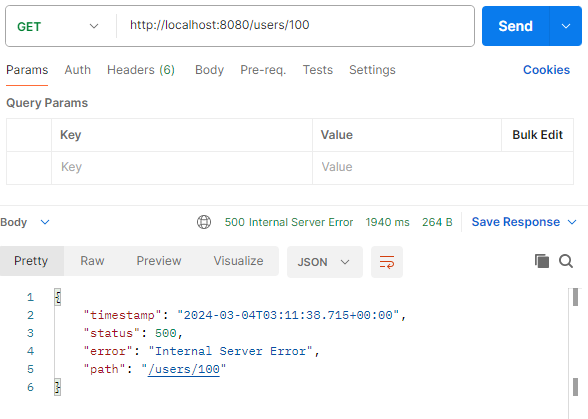

# Service
更新や登録、例外が発生したときにthrowするなど機能上必要な処理を **ビジネスロジック** や **業務処理** という。  
この **ビジネスロジックを担う専用のクラスを作成する** ことで、各コードの責務を明確にすることができる。  
  
  
# Serviceの実装
ビジネスロジックを担うクラスを作成する。  
名前はプロジェクトによって異なりますが、ここではServiceという言葉を使う。  
下記ではServiceからデータベースとやりとりするMapperを呼び出す。  
```java
@Service //これをつけないSpringがSeviceだと判別しない
 public class NameService {
    private NameMapper nameMapper; //フィールド　NameMapperクラスのメソッドを使いたいからNameMapper型のnameMapperを定義

    public NameService(NameMapper nameMapper) { //コンストラクタ
        this.nameMapper = nameMapper;
    }

    public List<Name> findAll() {   //メソッド　操作内容を記述
        return nameMapper.findAll(); //findAllしたものをList<Name>に戻している
    }
}
```
  
## ControllerからServiceを呼び出す。  

＜前回作成したController＞  
```java
@RestController//Mapperに依存している
public class NameController {
    private final NameMapper nameMapper;
    
    public NameController(NameMapper nameMapper) {
        this.nameMapper = nameMapper;
    }

    @GetMapping("/names")
    public List<Name> findByNames(NameSearchRequest request) {
        List<Name> names = nameMapper.findByNameStartingWith(request.getStartsWith(), request.getEndsWith());
        return names;

    }
}
```
 　
＜今回作成したController＞
```java
@RestController//前回作成したものと比べるとMapperが出てきておらず代わりにnameServiceが出てきていてnameServiceに依存している
 public class NameController {
 private final NameService nameService;
 public NameController(NameService nameService) {
 this.nameService = nameService;
    }
 @GetMapping("/names")
 public List<Name> getNames() {
 return nameService.findAll();
    }
 }
```
```java
@Service//Mappperに依存している
 public class NameService {
 private NameMapper nameMapper;
 public NameService(NameMapper nameMapper) {
 this.nameMapper = nameMapper;
  }
 public List<Name> findAll() {
 return nameMapper.findAll();
  }
 }
```
　　
★今回の依存関係★  
Controller→Service→Mapper  
  
この依存関係を壊してしまうと保守性が下がってしまうのでControllerでMappperが出てきたりなどは絶対にしない！！  
  
## 分岐のあるビジネスロジックをもつ実装例を見てみよう。  
たとえば以下のような機能を実装するとする。  
「idに指定したユーザーを取得する」  
この機能を実装する際に、  
「idに指定したユーザーが存在しない場合どうするのか？」  
というのは忘れがちだが考慮すべき重要なこと。 正常動作ではないが、想定される状況をどうハンドリングするのかはとても重要である。  
具体的にはあえて例外を発生させて、それをハンドリングする処理を書く。  
  
シーケンス図という処理内容を可視化するための設計書を用いてこれから作る処理を可視化する。  
・左→右、上→下で読む  
・スタートはClient。Postman,ブラウザやスマホなどHTTPリクエストを送るものがClientの主体である  
・optはオプションのこと  
  
  
## 次のようなAPIを実装しよう

| メソッド | パス          | 説明                     |
|------|-------------|------------------------|
| GET  | /users/{id} | {id}に指定したユーザーのデータを取得する |  
レスポンスのステータスコードは200、レスポンスボディは下記のようなものとする。  
```json
 {
"id": 1,
 "name": "john",
 "email": "john@example.com"
 }
```

存在しないIDを指定してリクエストした場合、ステータスコードは404を返す。  
レスポンスボディは下記のようなものにしたいとする。  
```json
{
  "message": "user not found",
  "timestamp": "2022-07-07T00:38:53.260151+09:00[Asia/Tokyo]",
  "error": "Not Found",
  "path": "/users/100",
  "status": "404"
}
```
  
### まずはMapperを実装
```java
@Mapper
public interface UserMapper {
@Select("SELECT * FROM users WHERE id = #{id}")//指定したIDという場合、MyBatisは#{id}とかく。
// こうすることでユーザーが指定した、あるいはコードの中の1とか2とかIDを埋め込んでくれる。
// このIDをどこから持ってくるかというと↓のfindById(int id)の引数から持ってくる。
Optional<User> findById(int id);
}
```
findByIdメソッドの返り値はOptional。  
OptionalはisPresent（存在するかどうかという意味）で値の存在チェックができる。　
  
### Serviceクラスを作る
今はあえて不完全な状態。  
```java
 @Service
public class UserService {
    private final UserMapper userMapper;

    public UserService(UserMapper userMapper) {
        this.userMapper = userMapper;
    }

    public User findUser(int id) {
        Optional<User> user = this.userMapper.findById(id);
        return user.get(); // Optional.get()は値が存在しない場合例外を発⽣させる
    }
}
```
  
### Controllerの実装
```java
@RestController
 public class UserController {
 private final UserService userService;
 public UserController(UserService userService) {
 this.userService = userService;
  }
 @GetMapping("/users/{id}")
 public User getUser(@PathVariable("id") int id) {
 return userService.findUser(id);
  }
 }
```
  
### このAPIに対して以下のようにアクセスしたときにレスポンスはどうなるか？
idが100のユーザーはデータベースに存在しないとする。  
↓結果  
  

Spring は例外発生時にとくに追加の設定をせずとも、 500 Internal Server Error を返す。  
エラーだからいいじゃないかと思うかもしれない。  
しかし、仕様では404を返すことになっているし、レスポンスボディも仕様と異なっている。  
このような場合は例外を発生させて、それをハンドリングする処理を書く。  
ハンドリングする手段に例外と例外をハンドリングするExceptionHandlerがある。  
ExceptionHandlerの扱い方は複数あるが、ここでは1例を紹介する。  
  
### まずリソースが見つからなかったときに扱う例外を作成
ユーザーが見つからなかったとき用の例外なのでUserNotFoundExceptionという例外を作成.
```java
public class UserNotFoundException extends RuntimeException {//UserNotFoundExceptionは自分でほかの名前を考える
 public UserNotFoundException(String message) {
 super(message);
  }
 }
```
  
次にUserを取得しているServiceで検索結果が存在しないときに例外をthrowする処理を記述。  
```java
@Service
 public class UserService {
 private final UserMapper userMapper;
 public UserService(UserMapper userMapper) {
 this.userMapper = userMapper;
  }
 public User findUser(int id) {
    Optional<User> user = this.userMapper.findById(id);
 if (user.isPresent()) {
 return user.get();
    } 
else {
 throw new UserNotFoundException("user not found");
    }
  }
 }
```

### Controllerに@ExceptionHandlerを付与したメソッドを追加
このメソッドはUserNotFoundExceptionがthrowされたときに呼び出される。  
Controllerに書かずに例外をハンドリングする専用のクラスを作成することもできます。
それには@ControllerAdviceを付与したクラスを作成する。  
```java
@ExceptionHandler(value = UserNotFoundException.class)//この一行があることによってUserNotFoundExceptionがどこで起きたとしても最終的にはここに行き着く
 public ResponseEntity<Map<String, String>> handleUserNotFoundException(
        UserNotFoundException e, HttpServletRequest request) {
    Map<String, String> body = Map.of(
 "timestamp", ZonedDateTime.now().toString(),//タイムゾーンまで考慮した日時を表示　タイムゾーン＝東京とかイギリスとかの場所
 "status", String.valueOf(HttpStatus.NOT_FOUND.value()),
 "error", HttpStatus.NOT_FOUND.getReasonPhrase(),
 "message", e.getMessage(),
 "path", request.getRequestURI());//ユーザーがリクエストしたURI
 return new ResponseEntity(body, HttpStatus.NOT_FOUND);//NOT_FOUNDだと404、OKだと200になる
 }
```