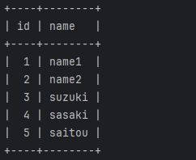
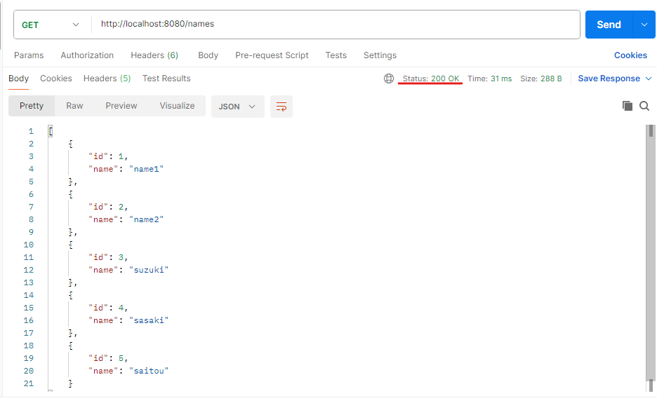
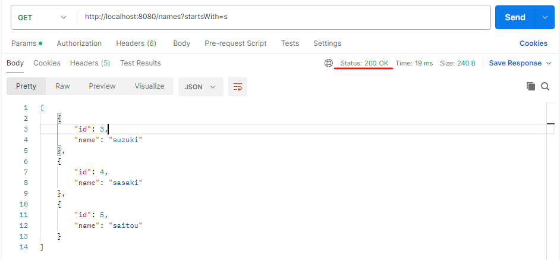
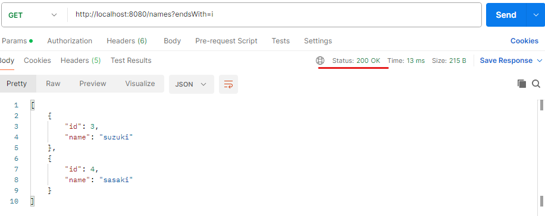
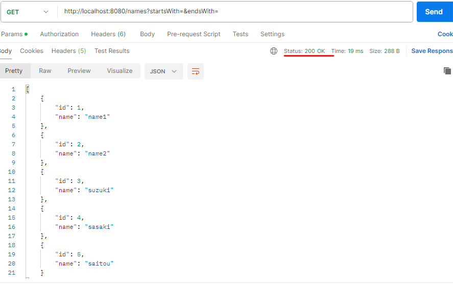
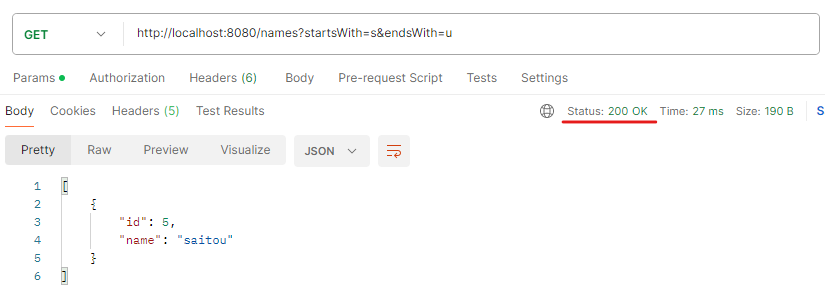
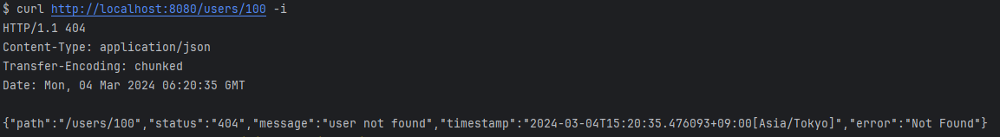
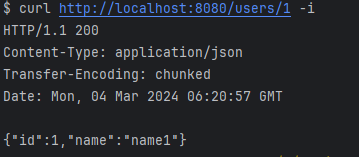

# Databases
namesテーブルに5つの名前のレコードが入っており、それぞれ順にIDが振り分けられています。  
  

# Read処理の実装
  
## 今回使用するURL
`http://localhost:8080/names` ・・・ Databases内すべてのデータを取得するURL  
`http://localhost:8080/names?startsWith=s` ・・・ 頭文字に『 s 』がつくモノだけ取得するURL  
`http://localhost:8080/names?endsWith=i` ・・・ 最後に『　i　』がつくモノだけ取得するURL  
`http://localhost:8080/names?startsWith=&endsWith=` ・・・何も指定しなかった場合のURL  
`http://localhost:8080/names?startsWith=s&endsWith=u`　・・・頭文字が『 s 』、最後の文字が『 u 』につくモノだけ取得するURL  
  
## 結果
・`http://localhost:8080/names`  
すべてのデータが返ってきており、ステータスコードも200で返ってきています。  
  
  
・`http://localhost:8080/names?startsWith=s`  
頭文字に『 s 』がつく、suzuki、sasaki、saitouが返ってきており、ステータスコードも200で返ってきています。  

  
・`http://localhost:8080/names?endsWith=i`  
最後に『 i 』がつくsuzuki,sasakiが返ってきており、ステータスコードも200で返ってきています。  
  
  
・`http://localhost:8080/names?startsWith=&endsWith=`  
頭文字、最後の文字どちらも指定せずに検索するとすべてのデータが返ってきており、ステータスコードも200で返ってきています。
  
  
・`http://localhost:8080/names?startsWith=s&endsWith=u`  
頭文字が『 s 』、最後の文字が『 u 』につく、saitouが返ってきており、ステータスコードも200で返ってきています。

  
# ServiceとIDでデータを取得するAPI、その際にデータベースに存在しないIDを指定した場合の例外ハンドリングを実装
## 今回使用するURL
`http://localhost:8080/users/｛id}` ・・・指定されたIDを持つデータを取得するURL
  
## 結果
・`http://localhost:8080/users/100`  
データベースに存在しないIDが指定された場合の例外が投げられ、指定したレスポンスボディが返ってきています。

  
・`http://localhost:8080/users/1`  
1のIDを持つ『name1』が返ってきており、ステータスコードも200で返ってきています。
